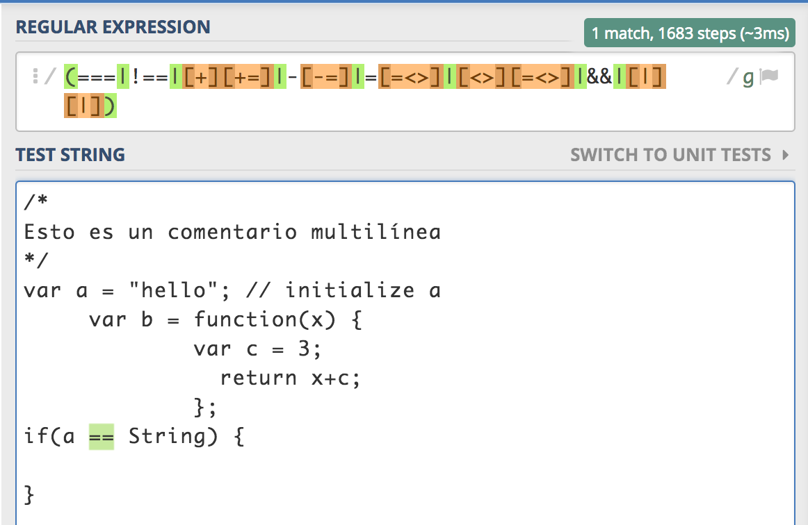

# Analizador léxico para un subconjunto de JavaScript

[TOC]

## Introducción

**¿Qué es un analizador léxico?**

Un analizador léxico y/o analizador lexicográfico (en inglés scanner) es la primera fase de un compilador consistente en un programa que recibe como entrada el código fuente de otro programa (secuencia de caracteres) y produce una salida compuesta de tokens (componentes léxicos) o símbolos. Estos tokens sirven para una posterior etapa del proceso de traducción, siendo la entrada para el analizador sintáctico (en inglés parser).


La especificación de un lenguaje de programación a menudo incluye un conjunto de reglas que definen el léxico. Estas reglas consisten comúnmente en expresiones regulares que indican el conjunto de posibles secuencias de caracteres que definen un token o lexema.

En algunos lenguajes de programación es necesario establecer patrones para caracteres especiales (como el espacio en blanco) que la gramática pueda reconocer sin que constituya un token en sí.

**¿Qué es un analizador sintáctico?**

Un analizador sintáctico (o parser) es una de las partes de un compilador que transforma su entrada en un árbol de derivación.

El análisis sintáctico convierte el texto de entrada en otras estructuras (comúnmente árboles), que son más útiles para el posterior análisis y capturan la jerarquía implícita de la entrada. Un analizador léxico crea tokens de una secuencia de caracteres de entrada y son estos tokens los que son procesados por el analizador sintáctico para construir la estructura de datos.

El siguiente caso demuestra un caso común de análisis de un lenguaje de programación con dos niveles de gramática, léxica y sintáctica.

El primer estado es la generación de tokens o análisis léxico, en este proceso la cadena de entrada se parte en símbolos con significado definidos por una gramática de expresiones regulares, por ejemplo un programa calculadora con la siguiente entrada: "12*(3+4)^2", la dividiría en los siguientes tokens 12, *, (, 3, +, 4, ), ^ y 2, cada uno de estos símbolos tiene un significado en el contexto de la expresión aritmética. El analizador contendrá reglas para indicar que los símbolos *, +, ^, ( y ) indican el comienzo de un nuevo token, de modo que otros tokens que no tendrían sentido como 12 o 13 no se generarán.

El siguiente estado es el análisis sintáctico lo que significa comprobar que los tokens forman una expresión válida, esto se hace usualmente usando una gramática.

**Clasificación**

- Analizador sintáctico descendente (*Top-Down-Parser*): ..un analizador puede empezar con el símbolo inicial e intentar transformarlo en la entrada, intuitivamente esto sería ir dividiendo la entrada progresivamente en partes cada vez más pequeñas.
- Analizador sintáctico ascendente (*Bottom-Up-Parser*): un analizador puede empezar con la entrada e intentar llegar hasta el símbolo inicial, intuitivamente el analizador intenta encontrar los símbolos más pequeños y progresivamente construir la jerarquía de símbolos hasta el inicial.


Veámos la solución propuesta por el profesor cómo funciona a continuación.

## Comprobando las expresiones regulares

1. ### Espacios en blanco

   

2. ### Identificador

   

3. ### Números

   

4. ### Cadenas

   

5. ### Comentarios de una línea

   

6. ### Comentarios de varias líneas

   

7. ### Operadores de un sólo carácter

   

8. ### Operadores de varios caracteres

   

## ¿Cómo funciona el analizador?

```javascript
/* 
* Versión original
*/
String.prototype.tokens = function (prefix, suffix) {
    'use strict';
    var c;                      // The current character.
    var from;                   // The index of the start of the token.
    var i = 0;                  // The index of the current character.
    var length = this.length;
    var n;                      // The number value.
    var q;                      // The quote character.
    var str;                    // The string value.

    var result = [];            // An array to hold the results.

    var make = function (type, value) {

// Make a token object.

        return {
            type: type,
            value: value,
            from: from,
            to: i
        };
    };
  
  	// ...
}
```

En la versión original el programa va leyendo la entrada carácter a carácter analizando el token mediante reglas, para ello se requeria de variables como *c* para indicar si lo que lee es un carácter, *n*  para saber si era un numero, etc.

```javascript
var c;                      // The current character.
var from;                   // The index of the start of the token.
var i = 0;                  // The index of the current character.
var length = this.length;
var n;                      // The number value.
var q;                      // The quote character.
var str;                    // The string value.
```

Por el contrario, en la versión propuesta simplemente hacemos uso de una variable *m* que muestra con que expresión regular caza la entrada.

```javascript
/*
* Solución propuesta usando expresiones regulares
*/

String.prototype.tokens = function () {
    var from;                   // The index of the start of the token.
    var i = 0;                  // The index of the current character.
    var n;                      // The number value.
    var m;                      // Matching
    var result = [];            // An array to hold the results.

    var WHITES              = /\s+/g;
    var ID                  = /[a-zA-Z_]\w*/g;
    var NUM                 = /\b\d+(\.\d*)?([eE][+-]?\d+)?\b/g;
    var STRING              = /('(\\.|[^'])*'|"(\\.|[^"])*")/g;
    var ONELINECOMMENT      = /\/\/.*/g;
    var MULTIPLELINECOMMENT = /\/[*](.|\n)*?[*]\//g;
    var TWOCHAROPERATORS    = /(===|!==|[+][+=]|-[-=]|=[=<>]|[<>][=<>]|&&|[|][|])/g;
    var ONECHAROPERATORS    = /([-+*\/=()&|;:,<>{}[\]])/g; // May be some character is missing?
    var tokens = [WHITES, ID, NUM, STRING, ONELINECOMMENT, 
                  MULTIPLELINECOMMENT, TWOCHAROPERATORS, ONECHAROPERATORS ];


    // Make a token object.
    var make = function (type, value) {
        return {
            type: type,
            value: value,
            from: from,
            to: i
        };
    };
  
  //...
}
```

Veamos ahora alguna de las reglas que usa la versión original para ignorar los espacios en blanco:

```javascript
// Ignore whitespace.

        if (c <= ' ') {
            i += 1;
            c = this.charAt(i);
```

Como vemos lo que hace es simplemente comparar el símbolo de entrada con el de un carácter blanco y si lo es avanza en uno la entrada. Sin embargo veámos la nueva solución como sería:

```javascript
// Ignore whitespace and comments
        if (m = WHITES.bexec(this) || 
           (m = ONELINECOMMENT.bexec(this))  || 
           (m = MULTIPLELINECOMMENT.bexec(this))) { getTok(); }
```

sólo correspondería con la primera condición del *if* pero se ve claramente que lo que hace es cazar la entrada con una expresión regular que reconoce los espacios en blanco.

Del mismo modo funciona para reconocer los demás tokens, veámos las diferencias...

```javascript
/* 
* Versión original
*/
		//...
		// number.
        else if (m = NUM.bexec(this)) {
            n = +getTok();

            if (isFinite(n)) {
                result.push(make('number', n));
            } else {
                make('number', m[0]).error("Bad number");
            }
        } 
        // string
        else if (m = STRING.bexec(this)) {
            result.push(make('string', getTok().replace(/^["']|["']$/g,'')));
        } 
        // two char operator
        else if (m = TWOCHAROPERATORS.bexec(this)) {
            result.push(make('operator', getTok()));
        // single-character operator
        } else if (m = ONECHAROPERATORS.bexec(this)){
            result.push(make('operator', getTok()));
        } else {
          throw "Syntax error near '"+this.substr(i)+"'";
        }
		//...


/*
* Solución propuesta usando expresiones regulares
*/

		//...
		// name.
        } else if ((c >= 'a' && c <= 'z') || (c >= 'A' && c <= 'Z')) {
          str = c;
          i += 1;
          while (true) {
            c = this.charAt(i);
            if ((c >= 'a' && c <= 'z') || (c >= 'A' && c <= 'Z') ||
                (c >= '0' && c <= '9') || c === '_') {
              str += c;
              i += 1;
            } else {
              break;
            }
          }
          result.push(make('name', str));
        //...
```


## Referencias

[](https://es.wikipedia.org/wiki/Analizador_l%C3%A9xico)

[](https://github.com/douglascrockford/TDOP/blob/master/tokens.js)

[](https://github.com/crguezl/ull-etsii-grado-pl-minijavascript/blob/gh-pages/tokens.js)

[](https://regex101.com/)